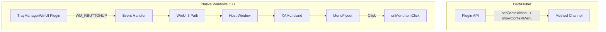

# tray_manager_winui

[](LICENSE)
[](https://flutter.dev)
[](https://docs.flutter.dev/platform-integration/windows)

WinUI 3 context menu extension for [tray_manager](https://github.com/leanflutter/tray_manager) – modern Fluent Design on Windows.


Instead of the classic Win32 menu (`CreatePopupMenu`/`TrackPopupMenu`), this plugin displays a WinUI 3 `MenuFlyout`. It is **not a replacement** for tray_manager, but an **extension**: The tray icon infrastructure stays with tray_manager; only the menu rendering logic is swapped with an optional WinUI menu.

---

## Table of Contents

- [Features](#features)
- [Requirements](#requirements)
- [Installation](#installation)
- [Usage](#usage)
- [API Reference](#api-reference)
- [Architecture](#architecture)
- [Context Menu Styling](#context-menu-styling)
- [Build Integration (WinUI)](#build-integration-winui)
- [Install Windows App SDK Runtime](#install-windows-app-sdk-runtime)
- [Run the Example App](#run-the-example-app)
- [Troubleshooting](#troubleshooting)
- [Limitations](#limitations)
- [Status](#status)
- [Links](#links)

---

## Features

| Feature | Description |
|---------|-------------|
| WinUI 3 MenuFlyout | Modern Fluent Design instead of classic Win32 menu |
| MenuItem (Standard) | With `label`, `onClick` |
| MenuItem.separator() | Separator lines |
| MenuItem.checkbox() | Checkbox state, `checked`, `onClick` |
| MenuItem.submenu() | Nested submenus |
| MenuItem(disabled: true) | Disabled items |
| onMenuItemClick Stream | Reactive click handling |
| Context Menu Styling | Optional [WinUIContextMenuStyle](lib/src/winui_context_menu_style.dart) for background, text color, font, corners, padding, theme |
| Click Outside Closes Menu | Menu closes on outside click (WM_ACTIVATE-based) |

---

## Requirements

- **Windows**: 10 1903+ (for XAML Islands)
- **Windows App SDK**: 1.5+ (MddBootstrap, MenuFlyout.ShowAt fix [microsoft-ui-xaml#7989](https://github.com/microsoft/microsoft-ui-xaml/issues/7989))
- **Build**: Visual Studio 2022 with C++ Desktop Development Workload
- **Runtime**: Windows App Runtime (e.g. `winget install Microsoft.WindowsAppRuntime.1.5`)
- **NuGet**: In PATH for automatic package download (Microsoft.WindowsAppSDK, Microsoft.Windows.CppWinRT)

---

## Installation

```yaml
dependencies:
  tray_manager: ^0.5.2
  tray_manager_winui: ^0.1.0
  menu_base: ^0.1.0   # comes via tray_manager, may need to be explicit
```

**Until published on pub.dev:** Use the Git dependency instead:

```yaml
tray_manager_winui:
  git:
    url: https://github.com/AlbertLongBong/tray_manager_winui.git
```

`menu_base` is re-exported by tray_manager; with path dependencies (local development) you may need to specify it explicitly.

---

## Usage

**Important:** `tray_manager_winui` only replaces the menu display. Tray icon, `setIcon`, `setToolTip`, and `TrayListener` remain with tray_manager.

1. **Set up tray with tray_manager** – Icon, tooltip, listener
2. **Menu with `TrayManagerWinUI.instance.setContextMenu()`** – *not* `trayManager.setContextMenu()`
3. **onTrayIconRightMouseDown** – `TrayManagerWinUI.instance.showContextMenu()` instead of `trayManager.popUpContextMenu()`
4. **onMenuItemClick** – listen to `TrayManagerWinUI.instance.onMenuItemClick`

```dart
import 'dart:io';

import 'package:flutter/material.dart';
import 'package:menu_base/menu_base.dart';
import 'package:tray_manager/tray_manager.dart';
import 'package:tray_manager_winui/tray_manager_winui.dart';

class _MyAppState extends State<MyApp> with TrayListener {
  bool _optA = false;
  Menu? _menu;

  @override
  void initState() {
    super.initState();
    trayManager.addListener(this);
    if (Platform.isWindows) {
      trayManager.setIcon('images/tray_icon.ico');
      trayManager.setToolTip('My App');
    }
    _setupWinUIMenu();
  }

  void _setupWinUIMenu() {
    _menu = Menu(
      items: [
        MenuItem(label: 'Open', onClick: (_) => /* ... */),
        MenuItem.separator(),
        MenuItem.checkbox(
          label: 'Option A',
          checked: _optA,
          onClick: (item) => setState(() => _optA = item.checked ?? false),
        ),
        MenuItem.submenu(
          label: 'More',
          submenu: Menu(items: [
            MenuItem(label: 'Submenu Item', onClick: (_) => /* ... */),
          ]),
        ),
        MenuItem.separator(),
        MenuItem(label: 'Exit', onClick: (_) => exit(0)),
      ],
    );
    // Optional: style parameter for custom appearance
    TrayManagerWinUI.instance.setContextMenu(_menu!, style: const WinUIContextMenuStyle(
      backgroundColor: Color(0xFF2D2D2D),
      textColor: Color(0xFFFFFFFF),
      fontSize: 14,
      cornerRadius: 8,
      themeMode: WinUIThemeMode.dark,
    ));
    TrayManagerWinUI.instance.onMenuItemClick.listen(_handleMenuItemClick);
  }

  void _handleMenuItemClick(MenuItem menuItem) {
    // Click handling (e.g. for checkbox state update)
  }

  @override
  void onTrayIconRightMouseDown() {
    TrayManagerWinUI.instance.showContextMenu();
  }

  // Other TrayListener methods...
}
```

---

## API Reference

| Method/Property | Description |
|-----------------|-------------|
| `TrayManagerWinUI.instance` | Singleton instance |
| `setContextMenu(Menu menu, {WinUIContextMenuStyle? style})` | Set menu definition. Optional `style` for custom appearance. |
| `showContextMenu({double? x, double? y, WinUIFlyoutPlacement? placement})` | Show menu. Without `x`/`y` at cursor position; with both at (x,y) in screen pixels. `placement` controls position relative to anchor (e.g. `WinUIFlyoutPlacement.right` for left-handed users). Returns `true` if WinUI active, otherwise `false`. |
| `onMenuItemClick` | `Stream<MenuItem>` – Clicks on menu items |

---

## Architecture



- **tray_manager**: Tray icon, `setIcon`, `setToolTip`, Events (`onTrayIconRightMouseDown`)
- **tray_manager_winui**: Only displays the WinUI 3 context menu – no tray icon

---

## Context Menu Styling

The optional `style` parameter in `setContextMenu()` lets you customize the WinUI context menu appearance:


| Property | Type | Description |
|----------|------|-------------|
| `backgroundColor` | `Color?` | Menu popup background |
| `textColor` | `Color?` | Menu item text color |
| `fontSize` | `double?` | Font size (logical pixels) |
| `fontFamily` | `String?` | Font family (e.g. "Segoe UI") |
| `fontWeight` | `FontWeight?` | Font weight (100–900) |
| `cornerRadius` | `double?` | Corner rounding |
| `padding` | `EdgeInsets?` | Inner padding (left, top, right, bottom) |
| `minWidth` | `double?` | Minimum menu width |
| `themeMode` | `WinUIThemeMode?` | `light`, `dark`, or `system` |
| `separatorColor` | `Color?` | Separator line color |
| `disabledTextColor` | `Color?` | Text color for disabled items |
| `hoverBackgroundColor` | `Color?` | Background on item hover |
| `subMenuOpenedBackgroundColor` | `Color?` | Background when submenu is open (selected parent item) |
| `subMenuOpenedTextColor` | `Color?` | Text color when submenu is open |
| `borderColor` | `Color?` | Border color around menu |
| `borderThickness` | `double?` | Border width in logical pixels |
| `fontStyle` | `FontStyle?` | `FontStyle.normal` or `FontStyle.italic` |
| `checkedIndicatorColor` | `Color?` | When set: colored 4px stripe on left instead of checkmark on right. Text stays aligned with other items. |
| `itemHeight` | `double?` | Minimum height per menu item in logical pixels |
| `shadowElevation` | `double?` | Shadow: 0 = off, null = WinUI default (~32px). Values >0 set elevation programmatically (Translation.Z). |
| `compactItemLayout` | `bool` | Default: `true`. Compact layout without icon space before items. When `false`, WinUI standard with icon area is used (for Phase 2 icons). |

```dart
TrayManagerWinUI.instance.setContextMenu(menu, style: const WinUIContextMenuStyle(
  backgroundColor: Color(0xFF1E1E1E),
  textColor: Color(0xFFFFFFFF),
  fontSize: 14,
  cornerRadius: 8,
  themeMode: WinUIThemeMode.dark,
));
```

Without `style`, WinUI default values are used.

---

## Build Integration (WinUI)

- **Automatic**: NuGet in PATH → CMake loads WindowsAppSDK 1.5 + CppWinRT when configuring
- **Disable**: CMake option `-DTRAY_MANAGER_WINUI_USE_WINUI=OFF` (stub mode)
- **Without NuGet**: Stub is used (no visible menu, no errors)
- **Bundled DLL**: `Microsoft.WindowsAppRuntime.Bootstrap.dll` is copied to the plugin directory

---

## Install Windows App SDK Runtime

For end users or development:

```bash
winget install Microsoft.WindowsAppRuntime.1.5
```

Or manually: [Windows App SDK Releases](https://github.com/microsoft/WindowsAppSDK/releases)

---

## Run the Example App

1. `cd tray_manager_winui/example` (`tray_icon.ico` is already in `example/images/`)
2. `flutter pub get`
3. `flutter run -d windows`
4. Right-click the tray icon → WinUI context menu

The example app has two tabs:
- **Info**: Brief usage hint
- **Styling**: Style playground with all styling options – colors, font, layout, theme controllable via UI. Changes apply immediately; right-click the tray icon to preview. The "Copy code" button exports the current configuration as ready-to-use Dart code.

---

## Troubleshooting

| Problem | Solution |
|---------|----------|
| Menu does not appear | NuGet in PATH? Windows App SDK installed? `showContextMenu()` returns `false`? |
| Build error (WinRT/WindowsAppSDK) | VS 2022 C++ Desktop, Windows 10 SDK 19041+ |
| "MddBootstrap" error | Install WindowsAppRuntime via `winget install Microsoft.WindowsAppRuntime.1.5` |

In debug mode, `showContextMenu()` prints a console message when display fails.

---

## Limitations

- **Platform**: Windows only – on macOS/Linux `showContextMenu()` is a no-op
- **Icons**: Menu icons not yet implemented (Phase 2)
- **tray_manager**: Requires tray_manager for the tray icon; this plugin only renders the menu

---

## Status

| Feature | Status |
|---------|--------|
| Dart API, Method Channel | done |
| Native setContextMenu, showContextMenu | done |
| WinUI MenuFlyout (MVP) | done |
| Separator, disabled, Submenus, Checkbox | done |
| Context Menu Styling (WinUIContextMenuStyle) | done |
| Menu Icons | Phase 2 (not implemented) |

---

## Links

- [License (MIT)](LICENSE)
- [tray_manager](https://github.com/leanflutter/tray_manager)
- [Windows App SDK](https://learn.microsoft.com/en-us/windows/apps/windows-app-sdk/)
- [MenuFlyout (WinUI 3)](https://learn.microsoft.com/en-us/windows/windows-app-sdk/api/winrt/microsoft.ui.xaml.controls.menuflyout)
