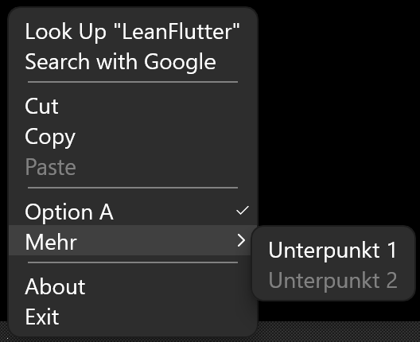
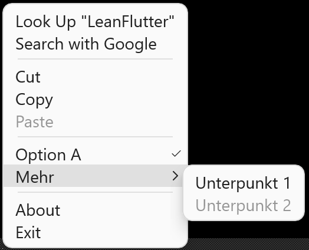
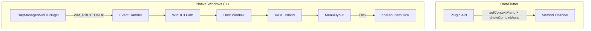
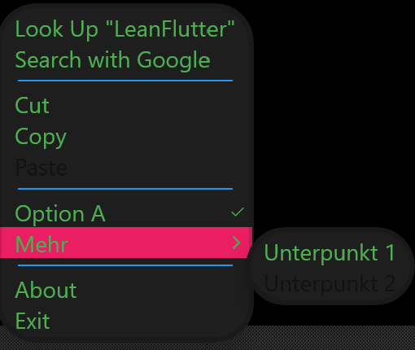
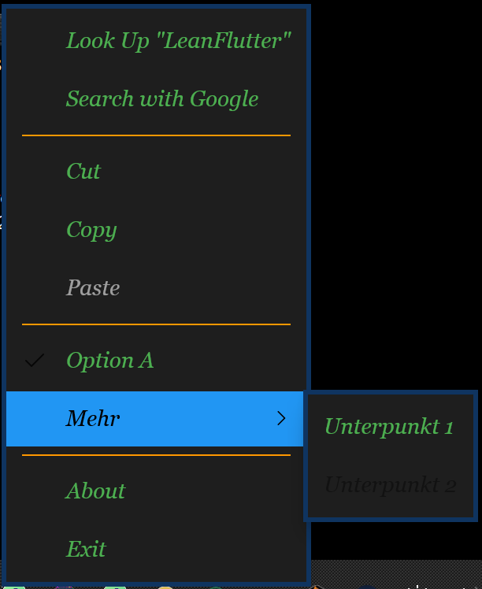

# tray_manager_winui

[](LICENSE)
[](https://flutter.dev)
[](https://docs.flutter.dev/platform-integration/windows)

WinUI 3 Kontextmenü-Erweiterung für [tray_manager](https://github.com/leanflutter/tray_manager) – modernes Fluent Design unter Windows.





Statt des klassischen Win32-Menüs (`CreatePopupMenu`/`TrackPopupMenu`) zeigt dieses Plugin ein WinUI 3 `MenuFlyout`. Es ist **kein Ersatz** für tray_manager, sondern eine **Ergänzung**: Die Tray-Icon-Infrastruktur bleibt bei tray_manager, nur die Menü-Rendering-Logik wird durch ein optionales WinUI-Menü ausgetauscht.

---

## Inhaltsverzeichnis

- [Features](#features)
- [Voraussetzungen](#voraussetzungen)
- [Installation](#installation)
- [Nutzung](#nutzung)
- [API-Referenz](#api-referenz)
- [Architektur](#architektur)
- [Kontextmenü-Styling](#kontextmenü-styling)
- [Build-Integration (WinUI)](#build-integration-winui)
- [Windows App SDK Runtime installieren](#windows-app-sdk-runtime-installieren)
- [Beispiel-App ausführen](#beispiel-app-ausführen)
- [Troubleshooting](#troubleshooting)
- [Einschränkungen](#einschränkungen)
- [Status](#status)
- [Links](#links)

---

## Features

| Feature | Beschreibung |
|---------|--------------|
| WinUI 3 MenuFlyout | Modernes Fluent Design statt klassischem Win32-Menü |
| MenuItem (Standard) | Mit `label`, `onClick` |
| MenuItem.separator() | Trennlinien |
| MenuItem.checkbox() | Checkbox-Zustand, `checked`, `onClick` |
| MenuItem.submenu() | Verschachtelte Untermenüs |
| MenuItem(disabled: true) | Deaktivierte Einträge |
| onMenuItemClick-Stream | Reaktive Klick-Verarbeitung |
| Kontextmenü-Styling | Optional [WinUIContextMenuStyle](lib/src/winui_context_menu_style.dart) für Hintergrund, Textfarbe, Schrift, Ecken, Padding, Theme |
| Klick außerhalb schließt Menü | Menü schließt sich beim Klick außerhalb (WM_ACTIVATE-basiert) |

---

## Voraussetzungen

- **Windows**: 10 1903+ (für XAML Islands)
- **Windows App SDK**: 1.5+ (MddBootstrap, MenuFlyout.ShowAt-Fix [microsoft-ui-xaml#7989](https://github.com/microsoft/microsoft-ui-xaml/issues/7989))
- **Build**: Visual Studio 2022 mit C++ Desktop Development Workload
- **Runtime**: Windows App Runtime (z.B. `winget install Microsoft.WindowsAppRuntime.1.5`)
- **NuGet**: Im PATH für automatischen Paket-Download (Microsoft.WindowsAppSDK, Microsoft.Windows.CppWinRT)

---

## Installation

```yaml
dependencies:
  tray_manager: ^0.5.2
  tray_manager_winui: ^0.1.0
  menu_base: ^0.1.0   # kommt über tray_manager, ggf. explizit erforderlich
```

**Bis zur Veröffentlichung auf pub.dev:** Nutze stattdessen die Git-Dependency:

```yaml
tray_manager_winui:
  git:
    url: https://github.com/ItzNotMe/tray_manager_winui.git
```

`menu_base` wird von tray_manager re-exportiert; bei path-Dependencies (lokale Entwicklung) ggf. explizit angeben.

---

## Nutzung

**Wichtig**: `tray_manager_winui` ersetzt *nur* die Menü-Anzeige. Tray-Icon, `setIcon`, `setToolTip` und `TrayListener` bleiben bei tray_manager.

1. **Tray mit tray_manager einrichten** – Icon, Tooltip, Listener
2. **Menü mit `TrayManagerWinUI.instance.setContextMenu()`** – *nicht* `trayManager.setContextMenu()`
3. **onTrayIconRightMouseDown** – `TrayManagerWinUI.instance.showContextMenu()` statt `trayManager.popUpContextMenu()`
4. **onMenuItemClick** – auf `TrayManagerWinUI.instance.onMenuItemClick` hören

```dart
import 'dart:io';

import 'package:flutter/material.dart';
import 'package:menu_base/menu_base.dart';
import 'package:tray_manager/tray_manager.dart';
import 'package:tray_manager_winui/tray_manager_winui.dart';

class _MyAppState extends State<MyApp> with TrayListener {
  bool _optA = false;
  Menu? _menu;

  @override
  void initState() {
    super.initState();
    trayManager.addListener(this);
    if (Platform.isWindows) {
      trayManager.setIcon('images/tray_icon.ico');
      trayManager.setToolTip('My App');
    }
    _setupWinUIMenu();
  }

  void _setupWinUIMenu() {
    _menu = Menu(
      items: [
        MenuItem(label: 'Öffnen', onClick: (_) => /* ... */),
        MenuItem.separator(),
        MenuItem.checkbox(
          label: 'Option A',
          checked: _optA,
          onClick: (item) => setState(() => _optA = item.checked ?? false),
        ),
        MenuItem.submenu(
          label: 'Mehr',
          submenu: Menu(items: [
            MenuItem(label: 'Unterpunkt', onClick: (_) => /* ... */),
          ]),
        ),
        MenuItem.separator(),
        MenuItem(label: 'Beenden', onClick: (_) => exit(0)),
      ],
    );
    // Optional: style-Parameter für angepasstes Erscheinungsbild
    TrayManagerWinUI.instance.setContextMenu(_menu!, style: const WinUIContextMenuStyle(
      backgroundColor: Color(0xFF2D2D2D),
      textColor: Color(0xFFFFFFFF),
      fontSize: 14,
      cornerRadius: 8,
      themeMode: WinUIThemeMode.dark,
    ));
    TrayManagerWinUI.instance.onMenuItemClick.listen(_handleMenuItemClick);
  }

  void _handleMenuItemClick(MenuItem menuItem) {
    // Klick-Verarbeitung (z.B. für Checkbox State-Update)
  }

  @override
  void onTrayIconRightMouseDown() {
    TrayManagerWinUI.instance.showContextMenu();
  }

  // Weitere TrayListener-Methoden...
}
```

---

## API-Referenz

| Methode/Property | Beschreibung |
|------------------|--------------|
| `TrayManagerWinUI.instance` | Singleton-Instanz |
| `setContextMenu(Menu menu, {WinUIContextMenuStyle? style})` | Menü-Definition setzen. Optional `style` für angepasstes Erscheinungsbild. |
| `showContextMenu({double? x, double? y, WinUIFlyoutPlacement? placement})` | Menü anzeigen. Ohne `x`/`y` an Cursor-Position; mit beiden an (x,y) in Bildschirm-Pixeln. `placement` steuert Position relativ zum Anker (z.B. `WinUIFlyoutPlacement.right` für Linkshänder). Gibt `true` wenn WinUI aktiv, sonst `false`. |
| `onMenuItemClick` | `Stream<MenuItem>` – Klicks auf Menüpunkte |

---

## Architektur



- **tray_manager**: Tray-Icon, `setIcon`, `setToolTip`, Events (`onTrayIconRightMouseDown`)
- **tray_manager_winui**: Nur Anzeige des WinUI 3 Kontextmenüs – kein Tray-Icon

---

## Kontextmenü-Styling

Über den optionalen Parameter `style` in `setContextMenu()` lässt sich das Erscheinungsbild des WinUI-Kontextmenüs anpassen:




| Eigenschaft | Typ | Beschreibung |
|-------------|-----|--------------|
| `backgroundColor` | `Color?` | Hintergrund des Menü-Popups |
| `textColor` | `Color?` | Textfarbe der Menüeinträge |
| `fontSize` | `double?` | Schriftgröße (logische Pixel) |
| `fontFamily` | `String?` | Schriftart (z.B. "Segoe UI") |
| `fontWeight` | `FontWeight?` | Schriftstärke (100–900) |
| `cornerRadius` | `double?` | Abrundung der Ecken |
| `padding` | `EdgeInsets?` | Innenabstand (left, top, right, bottom) |
| `minWidth` | `double?` | Mindestbreite des Menüs |
| `themeMode` | `WinUIThemeMode?` | `light`, `dark` oder `system` |
| `separatorColor` | `Color?` | Farbe der Trennlinien |
| `disabledTextColor` | `Color?` | Textfarbe für deaktivierte Einträge |
| `hoverBackgroundColor` | `Color?` | Hintergrund beim Hover über Einträge |
| `subMenuOpenedBackgroundColor` | `Color?` | Hintergrund wenn Untermenü geöffnet ist (ausgewählter Hauptpunkt) |
| `subMenuOpenedTextColor` | `Color?` | Textfarbe wenn Untermenü geöffnet ist |
| `borderColor` | `Color?` | Rahmenfarbe um das Menü |
| `borderThickness` | `double?` | Rahmendicke in logischen Pixeln |
| `fontStyle` | `FontStyle?` | `FontStyle.normal` oder `FontStyle.italic` |
| `checkedIndicatorColor` | `Color?` | Wenn gesetzt: farbiger 4px-Streifen links statt Häkchen rechts. Text bleibt mit anderen Einträgen bündig. |
| `itemHeight` | `double?` | Mindesthöhe pro Menüeintrag in logischen Pixeln |
| `shadowElevation` | `double?` | Schatten: 0 = aus, null = WinUI-Standard (~32px). Werte >0 setzen die Elevation programmatisch (Translation.Z). |
| `compactItemLayout` | `bool` | Standard: `true`. Kompaktes Layout ohne Icon-Platz vor Einträgen. Bei `false` wird der WinUI-Standard mit Icon-Bereich verwendet (für Phase-2-Icons). |

```dart
TrayManagerWinUI.instance.setContextMenu(menu, style: const WinUIContextMenuStyle(
  backgroundColor: Color(0xFF1E1E1E),
  textColor: Color(0xFFFFFFFF),
  fontSize: 14,
  cornerRadius: 8,
  themeMode: WinUIThemeMode.dark,
));
```

Ohne `style` werden die WinUI-Standardwerte verwendet.

---

## Build-Integration (WinUI)

- **Automatisch**: NuGet im PATH → CMake lädt WindowsAppSDK 1.5 + CppWinRT beim Konfigurieren
- **Deaktivieren**: CMake-Option `-DTRAY_MANAGER_WINUI_USE_WINUI=OFF` (Stub-Modus)
- **Ohne NuGet**: Stub wird verwendet (kein sichtbares Menü, keine Fehler)
- **Bundled DLL**: `Microsoft.WindowsAppRuntime.Bootstrap.dll` wird ins Plugin-Verzeichnis kopiert

---

## Windows App SDK Runtime installieren

Für Endnutzer bzw. Entwickler-Umgebung:

```bash
winget install Microsoft.WindowsAppRuntime.1.5
```

Oder manuell: [Windows App SDK Releases](https://github.com/microsoft/WindowsAppSDK/releases)

---

## Beispiel-App ausführen

1. `cd tray_manager_winui/example` (`tray_icon.ico` ist bereits in `example/images/` enthalten)
2. `flutter pub get`
3. `flutter run -d windows`
4. Rechtsklick auf das Tray-Icon → WinUI-Kontextmenü

Die Beispiel-App hat zwei Tabs:
- **Info**: Kurzer Hinweis zur Nutzung
- **Styling**: Style-Playground mit allen Styling-Optionen – Farben, Schrift, Layout, Theme per UI steuerbar. Änderungen werden sofort übernommen; Rechtsklick auf das Tray-Icon zur Vorschau. Der Button „Code kopieren“ exportiert die aktuelle Konfiguration als fertigen Dart-Code.

---

## Troubleshooting

| Problem | Lösung |
|---------|--------|
| Menü erscheint nicht | NuGet im PATH? Windows App SDK installiert? `showContextMenu()` gibt `false`? |
| Build-Fehler (WinRT/WindowsAppSDK) | VS 2022 C++ Desktop, Windows 10 SDK 19041+ |
| "MddBootstrap" Fehler | WindowsAppRuntime per `winget install Microsoft.WindowsAppRuntime.1.5` installieren |

In Debug-Modus gibt `showContextMenu()` bei fehlgeschlagener Anzeige eine Hinweismeldung in der Konsole aus.

---

## Einschränkungen

- **Plattform**: Nur Windows – auf macOS/Linux ist `showContextMenu()` ein No-Op
- **Icons**: Menü-Icons noch nicht implementiert (Phase 2)
- **tray_manager**: Erfordert tray_manager für das Tray-Icon; dieses Plugin rendert nur das Menü

---

## Status

| Feature | Status |
|---------|--------|
| Dart-API, Method Channel | ✅ |
| Native setContextMenu, showContextMenu | ✅ |
| WinUI MenuFlyout (MVP) | ✅ |
| Separator, disabled, Submenus, Checkbox | ✅ |
| Kontextmenü-Styling (WinUIContextMenuStyle) | ✅ |
| Menü-Icons | 🔲 Phase 2 |

---

## Links

- [Lizenz (MIT)](LICENSE)
- [tray_manager](https://github.com/leanflutter/tray_manager)
- [Windows App SDK](https://learn.microsoft.com/en-us/windows/apps/windows-app-sdk/)
- [MenuFlyout (WinUI 3)](https://learn.microsoft.com/en-us/windows/windows-app-sdk/api/winrt/microsoft.ui.xaml.controls.menuflyout)
